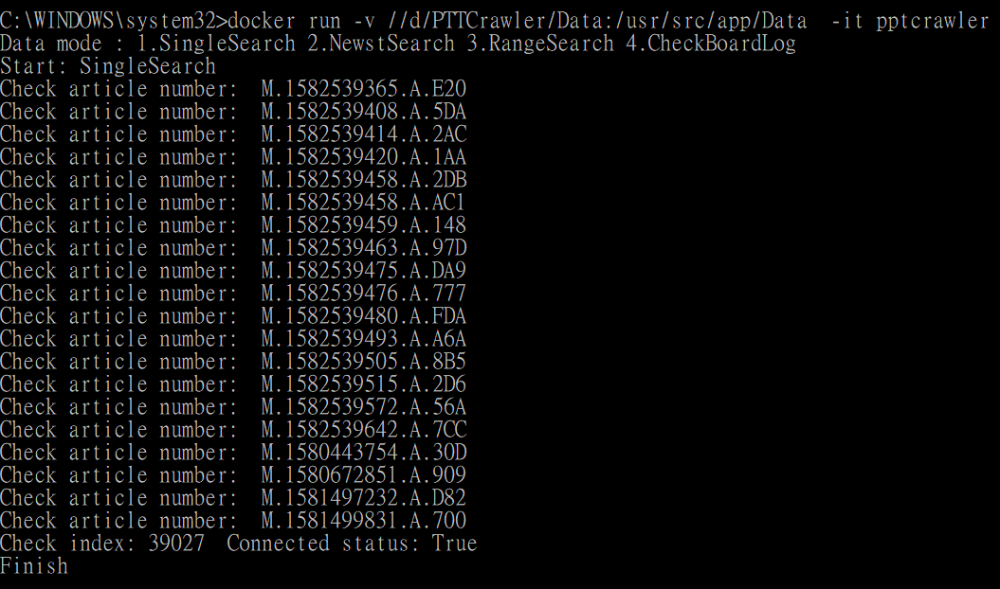

pptCrawler
============

摘要
------

應要求開發

Setup for windows
-------------------
Step 1. Get project:
* git clone https://github.com/CrimsonNightZero/PTTCrawler.git

Step 2. Download docker:
* Requires Microsoft Windows 10 Professional or Enterprise 64-bit:
* https://hub.docker.com/editions/community/docker-ce-desktop-windows
* other
* https://github.com/docker/toolbox/releases

Step 3. Create env:
* docker build "path" -t pptcrawler --no-cache
* ex: docker build D:\PTTCrawler  -t pptcrawler --no-cache

Step 4. Run project
* docker run -v "..host"/Data:/usr/src/app/Data  -it pptcrawler
* ex: docker run -v //d/PTTCrawler/Data:/usr/src/app/Data  -it pptcrawler

docker system prune : clean ((REPOSITORY == None) and (TAG == None))

docker ps : find running container

docker exec -it "container"(cbb76a7805fe)  bash : Operation docker

Program summary
-----------------
* Main program : ppt.py
* PPTSearch.py : PPT網頁搜索
* SQliteOperator.py : 對於sqlite資料庫操作
* Directory Data: Data sharing between Host and container

* Result:
* 

Data
-----------------
* Tweet.db : id -> Primary key, authorId -> 作者編號, authorName -> 作者暱稱, title -> 標題, publishedTime -> 貼文時間, content -> 內文, canonicalUrl -> 標準網址, createdTime -> 資料建立時間, updateTime -> 資料更新時間
* Comment.db : tweet_id -> 推文資料庫的id當作Foreign key, commentId -> 推文者編號, commentContent -> 推文內容, commentTime -> 推文時間
* Log.db : id -> Primary key, urlIndex -> 看板Index
